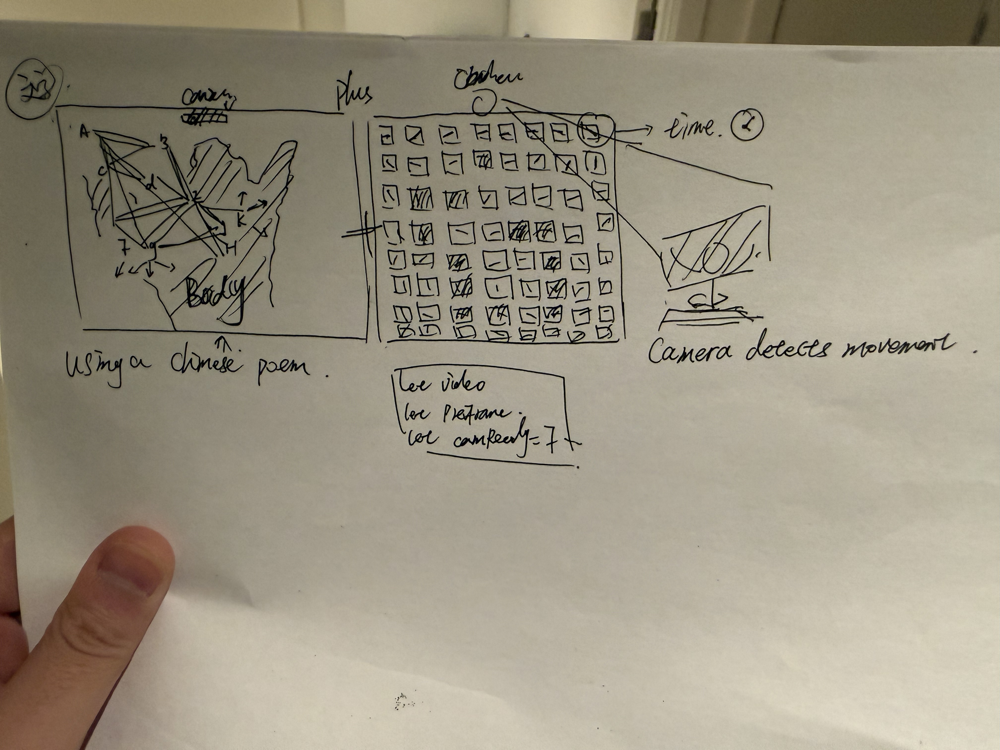

# Unreturnable Memory

## Short Description
"Unreturnable Memory" is an interactive generative poetry system. Through the grid sensed by the camera and the floating Chinese characters, time is presented as a state of "accumulation, delay and existence", rather than a linear flow.
Work video: https://vimeo.com/1150205527

## Concept / Intent
This project is titled "China's Northeast and Time", and it interprets time as a non-linear and continuous state rather than a forward-moving process.
The grids in the picture exist with slow energy fluctuations, symbolizing the time structure formed by the repeated superposition of industry, climate and memory; the floating Chinese poems form a short and fragile network of relationships in the noise field. 
The bodies of the audience are introduced into the system through the cameras, disrupting the originally smooth order and causing disturbances, ghost images and delays in the picture. The audience does not directly control the system; instead, they intervene as "environmental variables", causing a deviation in the temporal structure and thus creating an experience of "time always existing".

p5.js real-time visual system
Camera input for capturing audience movements
Flow Field controls text drift
Particleized text system for floating and connecting Chinese characters

## How to Run / Install
1. Open the p5.js program in the browser.
2. Allow the webpage to access the camera.
3. Move your body in front of the camera.
4. The grid and text will be disturbed, have ghost images and experience time delay due to your movements.

## Requirements
Modern browsers (Chrome recommended)
p5.js runtime environment

## Screenshots / Media

## Credits / Acknowledgements
Tianyi Cai

This project is a personal artistic and academic creation, suitable for display and teaching purposes.

References
Bergson, H. (1910) Time and Free Will: An Essay on the Immediate Data of
Consciousness. London: George Allen & Unwin.
Reas, C. and Fry, B. (2007) Processing: A Programming Handbook for Visual
Designers and Artists. Cambridge, MA: MIT Press.

Technical References
Coding Challenge – Perlin Noise Flow Field:
https://www.youtube.com/watch?v=BjoM9oKOAKY

Flow Field Example: https://editor.p5js.org/frederer/sketches/DbWjEErKy

How to create a flow field-- QXuR-XX_s
Colorful Coding: https://www.youtube.com/watch?v=1-

The combination and control of Webcam and Flow Field:
https://editor.p5js.org/isg2038/sketches/gnJAx-NVW

It provides many resource links, and explains how the flow field controls movement--
Patt Vira: https://www.youtube.com/watch?v=KOgRn2Brcdo

## Contact / Links
*GitHub repo link, website, demo URL.*
https://github.com/haochencai147-del/Skyone----Cai.git
